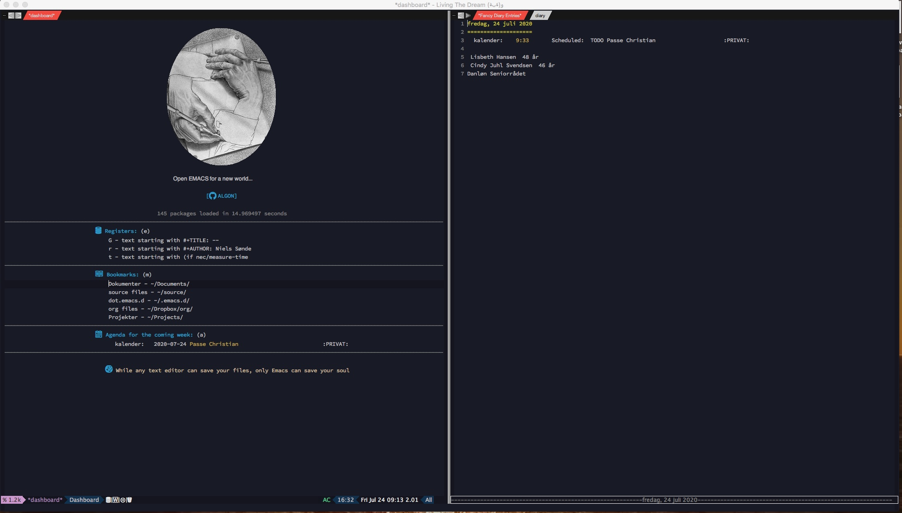

# Emacs configuration file

## Preface

This is my configuration og emacs, it’s not a general configurations to fit all. It reflects my needs and competence, and nothing more than that.

The present document, referred to in the source code version as config.org, contains the bulk of my configurations for GNU Emacs. It is designed using principles of “literate programming”: a combination of ordinary language and inline code blocks. 

Emacs knows how to parse this file properly so as to evaluate only the Elisp (“Emacs Lisp”) included herein. The rest is for humans to make sense of my additions and their underlying rationale.

Literate programming allows us to be more expressive and deliberate. Not only can we use typography to its maximum potential, but may also employ techniques such as internal links between sections. This makes the final product much more useful for end users than a terse script.

In more practical terms, this document is written using org-mode. It contains all package configurations for my Emacs setup. To actually work, it needs to be initialised from another file that only covers the absolute essentials.

## about me

My main competence is not programming, even though I started coding systems in assembler, PL/1, COBOL, Fortran, Pascal and C, some 40 years ago.
Most of that was forgotten, when I retired some years ago.

I’ve been using emacs for many years, but never went into any configuration, just vanilla emacs on different computers, as my main work were sales support.

So the expierience were not really good, but I’ve now for about half a year been playing with configuring my emacs.

I’m using an old iMAC 27” (Mid 2011 and High Sierra), this machine is about 10 years by now, and can’t be upgraded, however it suits me well, so I hesitate buying a new.

By the way, I’m a Dane from Denmark, born in 1945, and educated a Master of Science (Chemical engineering, with speciality in quantum mechanical theory and computer simulations of chemical reactions).
I'm not expecting to get a Nobel Prize, as my work still have not reached the mainstream industry, but I believe it will some day in the future :-)

## Required
You need til have 2 fonts: Source Code Pro Medium and OpenDyslexic are required.
Also You need to have a directory called "~/Projects/", and I have my orgfiles
described i the file "~/Dropbox/org/org-files".

## about this file

Thanks to at lot of people, I’ve had a lot of inspiration reading and trying to figure out, what they did and why they did it..

Insert a witty quote about imitation, theft, and plagiarism here. Many of the ideas in this file are ~stolen from~ inspired by the works of others:

A few to mention:

***John Wiegley***,
 ***Sacha Chua***,
 ***Musa Al-hassey***,
 ***Arjen Wiersma***,
 ***Dennis Ogbe***,
 ***Terencio Agozzino***,
 ***Karl Voit,*** but also configurations like purcell, doom, centaur and many more
has been the foundation for this.

The base for my emacs configuration, is the config comming from ___Ryan’s Minimal Emacs___ by ***Ryan Hajianpour***, but I don’t think there is anything left by now.

If you wonder, where You found this file….        
[Git Repo](github.com/algon-ns/nec.emacs.d)

